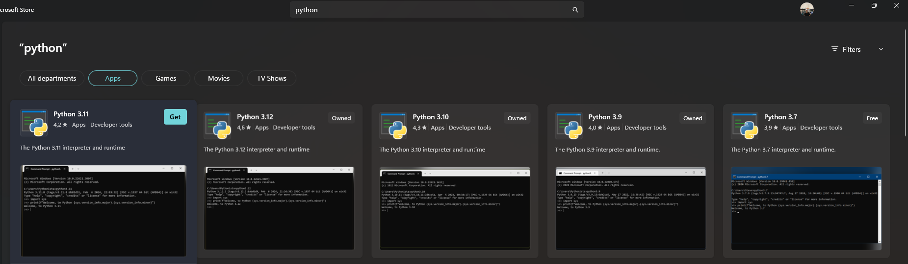
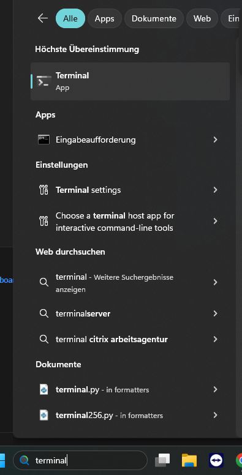
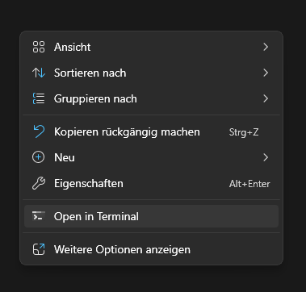

## Installation guide
Install python from the microsoft store:
+ search for python in the microsoft store -> Python -> (get) python 3.11



Open the windows terminal 


run the following command 

```
pip install panel numpy matplotlib holoviews
```
Download the folder and open it, right-click, and choose "Open in Terminal"



In the terminal run the following 
```panel serve --show app.py```
